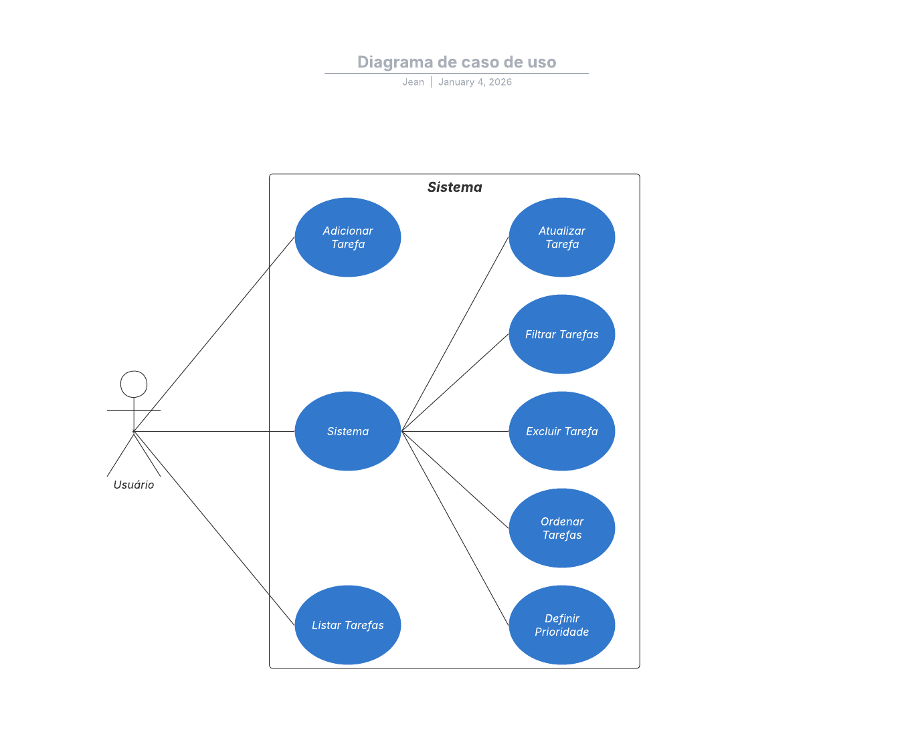
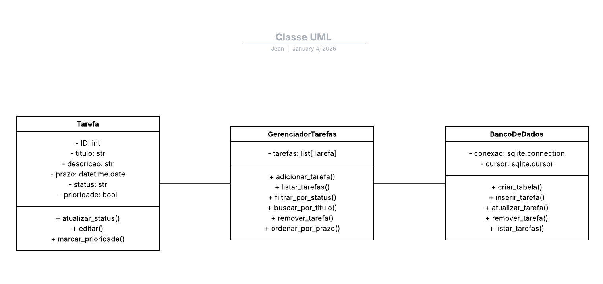

# GerenciamentoDeTarefas
Sistema local em ***Python** para Gerenciar tarefas de uma empresa permitindo que:

- Colaboradores Cadastrem novas tarefas.
- Tarefas possuam diferentes status (Pendente, Em Andamento ou Concluída).
- Filtrar tarefas.
- Excluir tarefas.
- Marcação de prioridade nas tarefas determinadas.

## Métodologia de Desenvolvimento
Este projeto foi desenvolvido seguindo práticas de **Engenharia de Software**, aplicando metodologias ágeis e ferramentas de apoio ao ciclo de vida do software.

### Levantamento de Requisitos
- Entrevistas com o cliente.
- Identificação das necessidades do sistema.
- Registro dos requisitos funcionais (RF) e não funcionais (RNF).

### Especificação de Requisitos
| Tipos de requisitos | Descrição |
| :-- | :--- |
|RF01| O sistema deve permitir cadastrar novas tarefas com título, descrição, prazo e status.|
|RF02| O sistema deve permitir listar todas as tarefas cadastradas.|
|RF03| O sistema deve permitir atualizar o status de uma tarefa (pendente, em andamento, concluída).|
|RF04| O sistema deve permitir editar informações de uma tarefa (título, descrição, prazo).|
|RF05| O sistema deve permitir excluir tarefas.|
|RF06| O sistema deve permitir filtrar tarefas por status.|
|RF07| O sistema deve permitir buscar tarefas pelo título ou descrição.|
|RF08| O sistema deve permitir ordenar tarefas por prazo ou status.|
|RF09| O sistema deve permitir marcar tarefas como prioritárias.|
|RF10| O sistema deve permitir visualizar detalhes completos de uma tarefa específica.|
|RNF01| O sistema deve utilizar banco de dados SQLite para armazenamento local.|
|RNF02| O tempo de resposta para operações (inserir, atualizar, excluir, listar) deve ser inferior a 2 segundos.|
|RNF03| O sistema deve ter interface simples e intuitiva (linha de comando).|
|RNF04| O sistema deve ser compatível com Python 3.12 ou superior.|
|RNF05| O sistema deve ser modular, permitindo fácil manutenção e evolução futura.|
|RNF06| O sistema deve funcionar sem necessidade de conexão com a internet.|

### Uso de Diagramas

**Caso de Uso**

---

**Diagrama de Classes**


### Gestão ágil com KanBan
- Utilização do **GitHub Projects** para organizar tarefas.
- Quadro Kanban com colunas: **To Do**, **In Progress**, **Done**.
- Issues criadas para cada **Requisito Funcional**

### Controle de Qualidade
- **GitHub Workflows (CI/CD):**
  - Execução automática de testes (Pytest).
  - Integração contínua para garantir qualidade do código.
- Testes unitários para validar regras de negócio.

### Engenharia de Software
- Aplicação dos conceitos de:
  - **Modelagem de requisitos** (casos de uso, classes).
  - **Modularidade** para facilitar manutenção.
  - **Integração contínua** para garantir confiabilidade.
  - **Documentação** clara no README.

## Como rodar localmente

### Clonar o repositório
```bash
git clone https://github.com/JeanCarlosAssuncao/GerenciamentoDeTarefas.git
```

### Pré-Requisitos
- Python 3.12+
- Git Instalado
---

### Instalação
1. Crie um ambiente virtual (opcional, mas recomendado):

```Bash
python -m venv venv
```

2. Ative o ambiente:
```Bash
source venv/bin/activate   # Linux/Mac
venv\Scripts\activate      # Windows
```

3. Instale as Dependências:
```Bash
pip install -r requirements.txt
```

### Executando o Sistema
Como o sistema é local e <b>baseado em prompt</b>, basta rodar:
```Bash
python main.py
```

O programa abrira um menu interativo no terminal, permitindo:
- Criar uma nova tarefa.
- Atualizar status de uma tarefa.
- Editar informações de uma tarefa.
- Excluir tarefa.
- Visualizar detalhes de uma terafa.

## Testes
Execute testes automatizados com:
```Bash
pytest
```

## Estrutura do projeto
```
src/
|--- models/                # Classes principais
|--- utils/                 # Funções auxiliares
|--- tests/                 # Testes automatizados
|--- docs/                  # Documentos do projeto
|--- main.py                # Ponto de entrada (Menu do prompt)
```

## Funcionalidades
- [ ] CRUD de tarefas.
- [ ] Ordenar tarefas.
- [ ] Marcar prioridade de tarefas.
- [ ] Filtro de tarefas.

## Licença
Este projeto está sob licença (MIT License) - veja o arquivo [LICENSE](LICENSE) para detalhes.

## Autor
- Projeto desenvolvido para disciplina de Engenharia de Software
- Professora: Patricia Ampese
- Aluno: JEAN CARLOS
- **UniFECAF**, Taboão da Serra/SP – **2025**